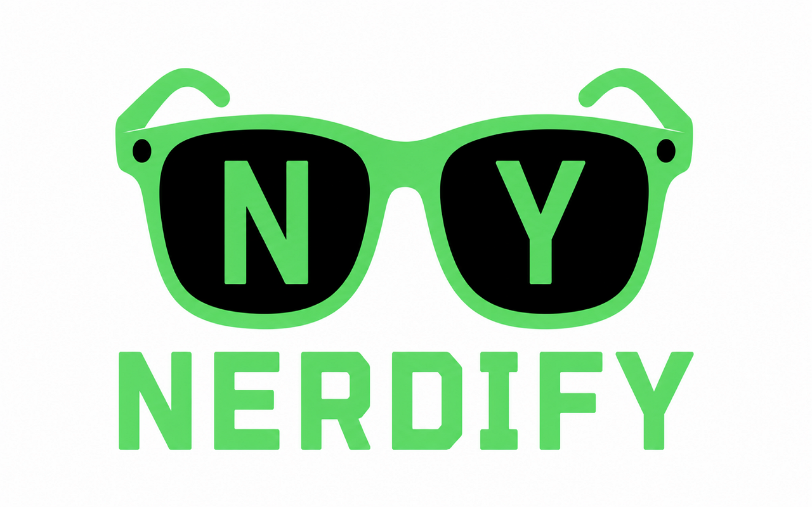

<p align="center">
  
</p>

# Nerdify

Render any website in a **Nerd Font** of your choice — with a global toggle,
per-site overrides, and an all-text / code-only scope. Built on Manifest V3, so
it runs unmodified in **Chrome, Edge, and Brave**.

> Nerd Fonts are patched monospace coding fonts. Nerdify is at its best on
> code-heavy pages (GitHub, docs, Stack Overflow) — see
> [What to expect](#what-to-expect).

## Install

<!-- Replace the placeholders below with the real listing URLs once published. -->

- **Chrome / Brave** — [Chrome Web Store](#) *(link pending review)*
- **Edge** — [Microsoft Edge Add-ons](#) *(link pending review)*

Brave installs Chrome extensions directly from the Chrome Web Store — no
separate listing needed.

Prefer to run it yourself? See [Build from source](#build-from-source).

## Features

- **Global on/off** across all sites
- **Per-site override** — `Inherit` follows the global toggle, `Force on` /
  `Force off` pin the behaviour for the current domain regardless of the global
  setting
- **Scope** — `All text` restyles every element; `Code only` limits the change
  to code blocks and editor widgets (`pre`, `code`, `kbd`, `samp`, CodeMirror,
  Monaco)
- **Font picker** — choose from the bundled Nerd Fonts; each option previews
  itself in its own typeface
- Settings sync via `chrome.storage.sync` and apply immediately to open tabs

## Usage

Click the toolbar icon to open the popup and adjust **global**, **this site**,
**scope**, and **font**. Changes take effect right away — no reload needed.

Pin the icon to your toolbar for quick access.

## What to expect

Nerd Fonts are patched **monospace** fonts. Applying one to an ordinary website
(news, blogs) turns all text monospaced — readable, but different from the
site's intended typography. That's why the **Code only** scope exists.

The special icon glyphs Nerd Fonts are known for (file-type icons, git symbols,
etc.) only render where the page's own text already contains those Unicode
codepoints. Switching the font does **not** inject new icons — it only changes
how existing characters are drawn.

## Privacy

Nerdify does **not** collect, transmit, or sell any data. There are no analytics
and no network requests. Your preferences (font choice, scope, per-site
overrides) are stored with the browser's own `chrome.storage.sync` and never
leave your browser profile. The `<all_urls>` host permission exists solely so
the font can be applied to whatever site you enable it on — page content is
never read or sent anywhere.

## Build from source

The bundled `.woff2` fonts are committed to the repo, so the extension works
immediately after a fresh clone — you only need the build step below if you want
to add, remove, or swap the fonts.

### Project layout

```
nerdify/
  fonts-source/        Drop your .ttf / .otf Nerd Font files here
  scripts/
    build_fonts.py     Converts fonts-source/*.ttf -> src/fonts/*.woff2 and
                       regenerates fonts.css, content.js, popup.html/js to match
  src/                 The actual extension (load this folder unpacked)
    manifest.json
    background.js
    content.js
    fonts.css          auto-generated, do not edit by hand
    fonts/             auto-generated .woff2 files (committed)
    icons/
    popup/
      popup.html       font-picker buttons auto-generated in place
      popup.css
      popup.js
```

### Regenerating the fonts

1. Put your Nerd Font `.ttf` / `.otf` files into `fonts-source/`. The repo ships
   with several example fonts so the script has something to run on out of the
   box — swap them for your own whenever you like; it picks up whatever files it
   finds, however many.
2. Install the conversion dependency:
   ```
   pip install fonttools brotli
   ```
3. Run the build script from the project root:
   ```
   python scripts/build_fonts.py
   ```
   This converts every font in `fonts-source/` to `.woff2`, writes them into
   `src/fonts/`, and regenerates `src/fonts.css`, the `FONT_MAP` in
   `src/content.js`, and the font-picker buttons in `src/popup/popup.html` —
   each font's real family name is pulled from its own internal name table, so
   naming stays accurate regardless of how the source files are named.
4. Re-run it any time you change the fonts. It's safe to run repeatedly — it
   fully regenerates the derived files rather than appending to them.

### Load unpacked (Chrome / Edge / Brave)

Same flow for all three — go to the extensions page, enable **Developer mode**,
click **Load unpacked**, and select the `nerdify/src` folder:

| Browser | Extensions page       |
| ------- | --------------------- |
| Chrome  | `chrome://extensions` |
| Edge    | `edge://extensions`   |
| Brave   | `brave://extensions`  |

After re-running `build_fonts.py`, click the reload icon on the extension's card
to pick up the changes.

## License

Nerdify's own code (everything in this repo except the bundled fonts) is
licensed under the **MIT License** — see [`LICENSE`](LICENSE).

The fonts in `src/fonts/` are third-party works under their **own** licenses,
which MIT does not override. Full texts and per-font copyright/attribution ship
inside the extension package in [`src/licenses/`](src/licenses/):

- **SIL Open Font License 1.1** — Anonymous Pro, Cascadia Code, Fira Code,
  Iosevka, JetBrains Mono, Source Code Pro, Victor Mono
  ([`src/licenses/OFL-1.1.txt`](src/licenses/OFL-1.1.txt))
- **MIT + Bitstream Vera License** — Hack (*not* OFL; see
  [`src/licenses/NOTICE.md`](src/licenses/NOTICE.md))

They live under `src/` so the store build (`Compress-Archive -Path .\src\*`)
ships them alongside the font binaries — OFL and the Bitstream Vera license both
require their text to travel with the fonts. If you change the fonts in
`fonts-source/` and rebuild, verify each new font's license and update
[`src/licenses/NOTICE.md`](src/licenses/NOTICE.md) before distributing publicly.
